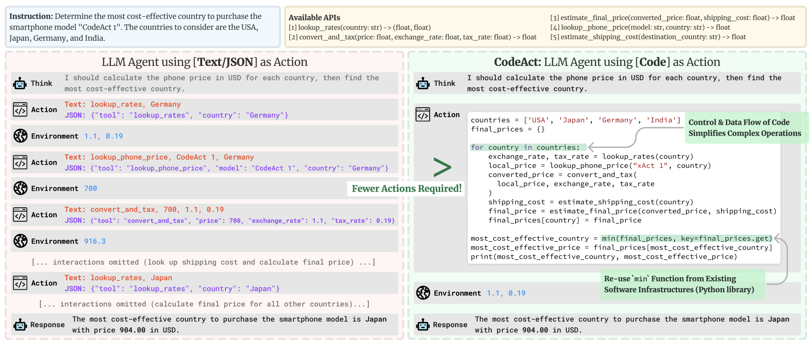

# Unit 1: Introduction to agents

  
Click to reveal

  
This is the hidden text that will be shown when clicked.

## Lesson 1: What is Agent?

Click to reveal

Step 5: Running Models Locally with Ollama (In case you run into Credit limits)

# What is an Agent?

1. Meet Alfred. Alfred is an Agent.
2. Because Alfred understands natural language, he quickly grasps our request.
3. Before fulfilling the order, Alfred engages in reasoning and planning, figuring out the steps and tools he needs to:

    - Go to the kitchen
    - Use the coffee machine
    - Brew the coffee
    - Bring the coffee back

4. Once he has a plan, he must act. 
5. To execute his plan, he can use tools from the list of tools he knows about.

    **And this is what an Agent is: an AI model capable of reasoning, planning, and interacting with its environment.**

    **We call it Agent because it has agency, aka it has the ability to interact with the environment.**

## More formal definition

<blockquote data-svelte-h="svelte-bqnsze">
An Agent is a system that leverages an AI model to interact with its environment in order to achieve a user-defined objective. It combines reasoning, planning, and the execution of actions (often via external tools) to fulfill tasks.
</blockquote>

# Main parts to the agent:

Think of the Agent as having two main parts:

## The Brain (AI Model)

This is where all the thinking happens. The AI model handles reasoning and planning. It decides which Actions to take based on the situation.

## The Body (Capabilities and Tools)

This part represents everything the Agent is equipped to do.

The scope of possible actions depends on what the agent has been equipped with. For example, because humans lack wings, they can’t perform the “fly” Action, but they can execute Actions like “walk”, “run” ,“jump”, “grab”, and so on.

# The spectrum of "Agency"

<table data-svelte-h="svelte-3oc2e1"><thead><tr><th>Agency Level</th> <th>Description</th> <th>What that’s called</th> <th>Example pattern</th></tr></thead> <tbody><tr><td>☆☆☆</td> <td>Agent output has no impact on program flow</td> <td>Simple processor</td> <td><code>process_llm_output(llm_response)</code></td></tr> <tr><td>★☆☆</td> <td>Agent output determines basic control flow</td> <td>Router</td> <td><code>if llm_decision(): path_a() else: path_b()</code></td></tr> <tr><td>★★☆</td> <td>Agent output determines function execution</td> <td>Tool caller</td> <td><code>run_function(llm_chosen_tool, llm_chosen_args)</code></td></tr> <tr><td>★★★</td> <td>Agent output controls iteration and program continuation</td> <td>Multi-step Agent</td> <td><code>while llm_should_continue(): execute_next_step()</code></td></tr> <tr><td>★★★</td> <td>One agentic workflow can start another agentic workflow</td> <td>Multi-Agent</td> <td><code>if llm_trigger(): execute_agent()</code></td></tr></tbody></table>

# What type of AI models do we use for Agents?

The most common AI model found in Agents is **an LLM (Large Language Model)**, which takes Text as an input and outputs Text as well.

Well known examples are GPT4 from OpenAI, LLama from Meta, Gemini from Google, etc. These models have been trained on a vast amount of text and are able to generalize well. 

# How does an AI take action on its environment?

LLMs are amazing models, but they can only generate text.

Developers of ChatGPT added tools for that.

# What type of tasks can an Agent do?

An Agent can perform any task we implement via Tools to complete Actions.

For example, if I write an Agent to act as my personal assistant (like Siri) on my computer, and I ask it to “send an email to my Manager asking to delay today’s meeting”, I can give it some code to send emails. This will be a new Tool the Agent can use whenever it needs to send an email. We can write it in Python:

<pre class="">def send_message_to(recipient, message):
    """Useful to send an e-mail message to a recipient"""
    ...</pre>

The design of the Tools is very important and has a great impact on the quality of your Agent. Some tasks will require very specific Tools to be crafted, while others may be solved with general purpose tools like “web_search”.

**Allowing an agent to interact with its environment allows real-life usage for companies and individuals.**

# Use cases of Agents

## Example 1: Personal Virtual Assistants

Virtual assistants like Siri, Alexa, or Google Assistant, work as agents when they interact on behalf of users using their digital environments.

## Example 2: Customer Service Chatbots

Many companies deploy chatbots as agents that interact with customers in natural language.

## Example 3: AI Non-Playable Character in a video game

AI agents powered by LLMs can make Non-Playable Characters (NPCs) more dynamic and unpredictable.

Instead of following rigid behavior trees, they can respond contextually, adapt to player interactions, and generate more nuanced dialogue. This flexibility helps create more lifelike, engaging characters that evolve alongside the player’s actions.

# Agent summary

To summarize, an Agent is a system that uses an AI Model (typically an LLM) as its core reasoning engine, to:

    - Understand natural language: Interpret and respond to human instructions in a meaningful way.

    - Reason and plan: Analyze information, make decisions, and devise strategies to solve problems.

    - Interact with its environment: Gather information, take actions, and observe the results of those actions.

## Lesson 2: What is a Large Language Model?

Click to reveal

**An LLM is a type of AI model that excels at understanding and generating human language.**

They are trained on vast amounts of text data, allowing them to learn patterns, structure, and even nuance in language. These models typically consist of many millions of parameters.

Most LLMs nowadays are built on the Transformer architecture—a deep learning architecture based on the “Attention” algorithm, that has gained significant interest since the release of BERT from Google in 2018.

**The underlying principle of an LLM is simple yet highly effective: its objective is to predict the next token, given a sequence of previous tokens.**

## There are 3 types of transformers

### Encoders
An encoder-based Transformer takes text (or other data) as input and outputs a dense representation (or embedding) of that text.

- **Example:** BERT from Google
- **Use Cases:** Text classification, semantic search, Named Entity Recognition
- **Typical Size:** Millions of parameters

### Decoders
A decoder-based Transformer focuses on generating new tokens to complete a sequence, one token at a time.

- **Example:** Llama from Meta
- **Use Cases:** Text generation, chatbots, code generation
- **Typical Size:** Billions (in the US sense, i.e., 10^9) of parameters

### Seq2Seq (Encoder–Decoder)
A sequence-to-sequence Transformer combines an encoder and a decoder. The encoder first processes the input sequence into a context representation, then the decoder generates an output sequence.

- **Example:**  T5, BART
- **Use Cases:** Translation, Summarization, Paraphrasing
- **Typical Size:** Millions of parameters

## Special tokens in different LLMs

<table><thead><tr><th><strong>Model</strong></th> <th><strong>Provider</strong></th> <th><strong>EOS Token</strong></th> <th><strong>Functionality</strong></th></tr></thead> <tbody><tr><td><strong>GPT4</strong></td> <td>OpenAI</td> <td><code>&lt;|endoftext|&gt;</code></td> <td>End of message text</td></tr> <tr><td><strong>Llama 3</strong></td> <td>Meta (Facebook AI Research)</td> <td><code>&lt;|eot_id|&gt;</code></td> <td>End of sequence</td></tr> <tr><td><strong>Deepseek-R1</strong></td> <td>DeepSeek</td> <td><code>&lt;|end_of_sentence|&gt;</code></td> <td>End of message text</td></tr> <tr><td><strong>SmolLM2</strong></td> <td>Hugging Face</td> <td><code>&lt;|im_end|&gt;</code></td> <td>End of instruction or message</td></tr> <tr><td><strong>Gemma</strong></td> <td>Google</td> <td><code>&lt;end_of_turn&gt;</code></td> <td>End of conversation turn</td></tr></tbody></table>

https://huggingface.co/learn/agents-course/unit1/what-are-llms

## Attention is all you need

A key aspect of the Transformer architecture is Attention. When predicting the next word, not every word in a sentence is equally important; words like “France” and “capital” in the sentence “The capital of France is …” carry the most meaning.

**This process of identifying the most relevant words to predict the next token has proven to be incredibly effective.**

## LLM basics

If you’ve interacted with LLMs, you’re probably familiar with the term **context length**, which **refers to the maximum number of tokens the LLM can process**, and the maximum attention span it has.

The input sequence you provide an LLM is called a **prompt**. Careful design of the prompt makes it easier to guide the generation of the LLM toward the desired output.

LLMs are trained **on large datasets of text**, where they learn to predict the next word in a sequence through a self-supervised or masked language modeling objective.

From this **unsupervised learning**, the **model learns the structure of the language and underlying patterns in text**, allowing the model to generalize to unseen data.

## How can I use LLMs?

You have two main options:
- Run Locally (if you have sufficient hardware).
- Use a Cloud/API (e.g., via the Hugging Face Serverless Inference API).

## Lesson 3: Messages and Special Tokens

Click to reveal

Up until now, we’ve discussed prompts as the sequence of tokens fed into the model. 

But when you chat with systems like ChatGPT or HuggingChat, you’re actually exchanging messages. Behind the scenes, these messages are concatenated and formatted into a prompt that the model can understand.

This is where chat templates come in. They act as the bridge between conversational messages (user and assistant turns) and the specific formatting requirements of your chosen LLM. 

## System Messages (system prompts)

System messages (also called System Prompts) define how the model should behave. They serve as persistent instructions, guiding every subsequent interaction.

<pre class="">system_message = {
    "role": "system",
    "content": "You are a professional customer service agent. Always be polite, clear, and helpful."
}</pre>

In regards to agents, **the System Message** also gives information about the available tools, provides instructions to the model on how to format the actions to take, and includes guidelines on how the thought process should be segmented.

## Conversations: User and Assistant Messages

A conversation consists of alternating messages between a Human (user) and an LLM (assistant).

Chat templates help maintain context by preserving conversation history, storing previous exchanges between the user and the assistant. This leads to more coherent multi-turn conversations.

<pre class="">conversation = [
    {"role": "user", "content": "I need help with my order"},
    {"role": "assistant", "content": "I'd be happy to help. Could you provide your order number?"},
    {"role": "user", "content": "It's ORDER-123"},
]</pre>

## Base Models vs. Instruct Models

- A Base Model is trained on raw text data to predict the next token.
- An Instruct Model is fine-tuned specifically to follow instructions and engage in conversations. For example, SmolLM2-135M is a base model, while SmolLM2-135M-Instruct is its instruction-tuned variant.

!!! To make a Base Model behave like an instruct model, we need to format our prompts in a consistent way that the model can understand. This is where chat templates come in. !!! 

## Lesson 4: Tools

Click to reveal

### What are AI Tools?

A Tool is a function given to the LLM. This function should fulfill a clear objective.

<table>
    <thead>
        <tr>
            <th>Tool</th> 
            <th>Description</th>
        </tr>
    </thead> 
    <tbody>
        <tr>
            <td>Web Search</td> 
            <td>Allows the agent to fetch up-to-date information from the internet.</td>
        </tr> 
            <tr>
            <td>Image Generation</td> 
            <td>Creates images based on text descriptions.</td>
        </tr> 
            <tr>
            <td>Retrieval</td> 
            <td>Retrieves information from an external source.</td>
        </tr> 
        <tr>
            <td>API Interface</td> 
            <td>Interacts with an external API (GitHub, YouTube, Spotify, etc.).</td>
        </tr>
    </tbody>
</table>

**Furthermore, LLMs predict the completion of a prompt based on their training data, which means that their internal knowledge only includes events prior to their training.**

**For instance, if you ask an LLM directly (without a search tool) for today’s weather, the LLM will potentially hallucinate random weather.**

### Model Context Protocol (MCP): a unified tool interface

- Model Context Protocol (MCP) is an open protocol that standardizes how applications provide tools to LLMs. MCP provides:
- A growing list of pre-built integrations that your LLM can directly plug into
- The flexibility to switch between LLM providers and vendors
Best practices for securing your data within your infrastructure

**This means that any framework implementing MCP can leverage tools defined within the protocol, eliminating the need to reimplement the same tool interface for each framework.**

## Lesson 5: Understanding AI Agents through the Thought-Action-Observation Cycle

Click to reveal

## The Core Components of the Agent

Agents work in a continuous cycle of: 
thinking (Thought) → acting (Act) and observing (Observe).

Let’s break down these actions together:
1. Thought: The LLM part of the Agent decides what the next step should be.
2. Action: The agent takes an action, by calling the tools with the associated arguments.
3. Observation: The model reflects on the response from the tool.

### Alfred, the weather Agent
We created Alfred, the Weather Agent.

A user asks Alfred: “What’s the current weather in New York?”

Steps:
1. Thought. Internal Reasoning:
    “The user needs current weather information for New York. I have access to a tool that fetches weather data. First, I need to call the weather API to get up-to-date details.”

2. Action. Tool Usage:

    Based on its reasoning and the fact that Alfred knows about a get_weather tool, Alfred prepares a JSON-formatted command that calls the weather API tool. 

3. Observation. Feedback from the Environment:

    After the tool call, Alfred receives an observation. This might be the raw weather data from the API such as:

    “Current weather in New York: partly cloudy, 15°C, 60% humidity.”

4. Updated thought. Reflecting:

    With the observation in hand, Alfred updates its internal reasoning:

    “Now that I have the weather data for New York, I can compile an answer for the user.”

5. Final Action

    Alfred then generates a final response formatted as we told it to:

    Thought: I have the weather data now. The current weather in New York is partly cloudy with a temperature of 15°C and 60% humidity.”

    **Final answer:** The current weather in New York is partly cloudy with a temperature of 15°C and 60% humidity.

## Lesson 6: **Thought:** Internal Reasoning and the ReAct Approach

Click to reveal

<table><thead><tr><th>Type of Thought</th> <th>Example</th></tr></thead> <tbody><tr><td>Planning</td> <td>“I need to break this task into three steps: 1) gather data, 2) analyze trends, 3) generate report”</td></tr> <tr><td>Analysis</td> <td>“Based on the error message, the issue appears to be with the database connection parameters”</td></tr> <tr><td>Decision Making</td> <td>“Given the user’s budget constraints, I should recommend the mid-tier option”</td></tr> <tr><td>Problem Solving</td> <td>“To optimize this code, I should first profile it to identify bottlenecks”</td></tr> <tr><td>Memory Integration</td> <td>“The user mentioned their preference for Python earlier, so I’ll provide examples in Python”</td></tr> <tr><td>Self-Reflection</td> <td>“My last approach didn’t work well, I should try a different strategy”</td></tr> <tr><td>Goal Setting</td> <td>“To complete this task, I need to first establish the acceptance criteria”</td></tr> <tr><td>Prioritization</td> <td>“The security vulnerability should be addressed before adding new features”</td></tr></tbody></table>

### The ReAct Approach

- A key method is the ReAct approach, which is the concatenation of “Reasoning” (Think) with “Acting” (Act).

- ReAct is a simple prompting technique that appends “Let’s think step by step” before letting the LLM decode the next tokens.

- Indeed, prompting the model to think “step by step” encourages the decoding process toward next tokens that generate a plan, rather than a final solution, since the model is encouraged to decompose the problem into sub-tasks.

## Lesson 7: **Actions**: Enabling the Agent to Engage with Its Environment

Click to reveal

Actions are the concrete steps an AI agent takes to interact with its environment.

<table><thead><tr><th>Type of Action</th> <th>Description</th></tr></thead> <tbody><tr><td>Information Gathering</td> <td>Performing web searches, querying databases, or retrieving documents.</td></tr> <tr><td>Tool Usage</td> <td>Making API calls, running calculations, and executing code.</td></tr> <tr><td>Environment Interaction</td> <td>Manipulating digital interfaces or controlling physical devices.</td></tr> <tr><td>Communication</td> <td>Engaging with users via chat or collaborating with other agents.</td></tr></tbody></table>

### The Stop and Parse Approach

One key method for implementing actions is the stop and parse approach. This method ensures that the agent’s output is structured and predictable:

Generation in a Structured Format:
The agent outputs its intended action in a clear, predetermined format (JSON or code).

Halting Further Generation:
Once the text defining the action has been emitted, the LLM stops generating additional tokens. This prevents extra or erroneous output.

Parsing the Output:
An external parser reads the formatted action, determines which Tool to call, and extracts the required parameters.

### Code Agents
An alternative approach is using Code Agents. The idea is: instead of outputting a simple JSON object, a Code Agent generates an executable code block—typically in a high-level language like Python.

This approach offers several advantages:

- Expressiveness: Code can naturally represent complex logic, including loops, conditionals, and nested functions, providing greater flexibility than JSON.
- Modularity and Reusability: Generated code can include functions and modules that are reusable across different actions or tasks.
- Enhanced Debuggability: With a well-defined programming syntax, code errors are often easier to detect and correct.
- Direct Integration: Code Agents can integrate directly with external libraries and APIs, enabling more complex operations such as data processing or real-time decision making.

## Lesson 8: **Observe**: Integrating Feedback to Reflect and Adapt

Click to reveal

**Observations are how an Agent perceives the consequences of its actions.**

In the observation phase, the agent:
- Collects Feedback: Receives data or confirmation that its action was successful (or not).
- Appends Results: Integrates the new information into its existing context, effectively updating its memory.
- Adapts its Strategy: Uses this updated context to refine subsequent thoughts and actions.

**This iterative incorporation of feedback ensures the agent remains dynamically aligned with its goals, constantly learning and adjusting based on real-world outcomes.**

<table><thead><tr><th>Type of Observation</th> <th>Example</th></tr></thead> <tbody><tr><td>System Feedback</td> <td>Error messages, success notifications, status codes</td></tr> <tr><td>Data Changes</td> <td>Database updates, file system modifications, state changes</td></tr> <tr><td>Environmental Data</td> <td>Sensor readings, system metrics, resource usage</td></tr> <tr><td>Response Analysis</td> <td>API responses, query results, computation outputs</td></tr> <tr><td>Time-based Events</td> <td>Deadlines reached, scheduled tasks completed</td></tr></tbody></table>

